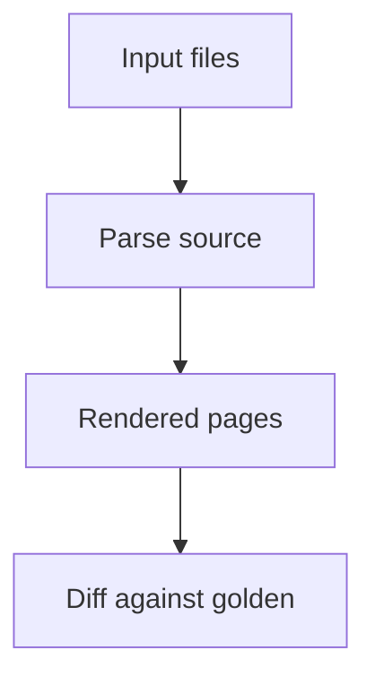

# Mermaid Diagrams

A flowchart renders client side:


```mermaid
flowchart TD
  src[Input files] --> parse[Parse source]
  parse --> out[Rendered pages]
  out --> check[Diff against golden]
```

A Go block gets highlighted:

```go
func main() {
	println("golden")
}
```
